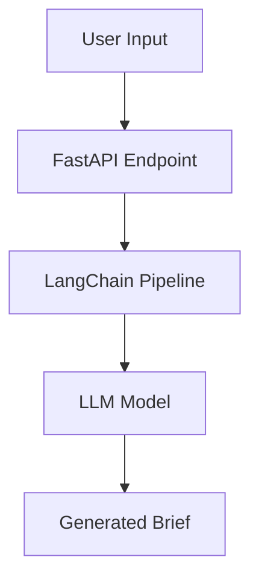

# **AtomicAds – Gen AI Developer Assignment**

---

## **📌 Overview**

AtomicAds is a **Generative AI-powered advertising brief generator** designed to help businesses and marketers create concise, targeted ad briefs using LLMs. It provides both **API** (FastAPI) and **CLI** interfaces and integrates with **LangSmith** for traceability and debugging.

---

## **✅ Features**

* **AI-Powered Brief Generation** using LangChain and LLMs.
* **FastAPI REST API** for programmatic access.
* **Command-Line Interface (CLI)** for quick usage.
* **LangSmith Trace Integration** for detailed execution logs.
* **Modular Design** with clear separation of concerns.

---

## **📂 Project Structure**

```
AtomicAds/
│   .env.example         # Environment variables template
│   Dockerfile           # For containerized deployment
│   requirements.txt     # Project dependencies
│   README.md            # Documentation
│
├───docs/
│       architecture.md   # Detailed design and architecture
│       sample_request.json
│       sample_response.json
│
├───src/
│   │   main.py          # FastAPI entry point
│   │   cli.py           # CLI entry point
│   │   graph.py         # Workflow orchestration
│   │   llms.py          # LLM configuration and calls
│   │   persistence.py   # Data persistence layer
│   │   retriever.py     # Information retrieval utilities
│   │   schemas.py       # Pydantic models
│   │   search_tools.py  # Search helper functions
│
└───tests/
        test_api.py       # API test cases
        test_schemas.py   # Schema validation tests
```

---

## **🛠 Tech Stack**

* **Language:** Python 3.12
* **Framework:** FastAPI
* **AI Orchestration:** LangChain
* **LLM Provider:** OpenAI (or equivalent)
* **Deployment:** Render / Docker
* **Tracing:** LangSmith
* **Testing:** Pytest

---

## **⚙️ Setup Instructions**

### **1. Clone Repository**

```bash
git clone https://github.com/yourusername/AtomicAds.git
cd AtomicAds
```

### **2. Install Dependencies**

```bash
pip install -r requirements.txt
```

### **3. Configure Environment Variables**

Create a `.env` file from `.env.example` and update:

```
OPENAI_API_KEY=your_openai_api_key
LANGCHAIN_API_KEY=your_langsmith_api_key
```

---

## **🚀 Running the API**

### **Start the API Server**

```bash
uvicorn src.main:app --host 0.0.0.0 --port 8000 --reload
```

### **API Endpoints**

**POST** `/generate`

* **Request Example:**

```json
{
  "topic": "Edge Computing",
  "depth": 2,
  "user_id": "zeeshan"
}
```

* **Response Example:**

```json
{
  "brief": "Edge computing is a distributed computing paradigm that processes data near the source of generation..."
}
```

---

## **💻 CLI Usage**

Run the CLI tool:

```bash
python src/cli.py --topic "Edge Computing" --depth 2 --user_id "zeeshan"
```

**Example Output:**

```
Generated Brief:
Edge computing brings computation and data storage closer to devices where it is being gathered...
```

---

## **🌐 Deployed API**

**Live URL:** [https://atomicads-api.onrender.com](https://atomicads-api.onrender.com) *(Update after deployment)*

---

## **📺 Demo Video**

**Watch here:** \[Insert YouTube or Google Drive Link] *(Update after recording)*

---

## **📊 LangSmith Trace**

* **Trace Link:** \[Insert LangSmith Trace URL]
* **Screenshot:** *(Add screenshot image here)*

---

## **📐 Architecture Diagram**



---

## **🔮 Future Enhancements**

* Add multiple ad formats (social, video, display ads).
* Support for multilingual briefs.
* Fine-tuned models for industry-specific briefs.

---

## **👨‍💻 Author**

**Mohammed Zeeshan Khan**
📧 Email: \[your email]
🔗 GitHub: \[your GitHub link]

---

✅ This README matches **your project structure**, includes **headings/sub-headings**, and covers **all assignment requirements**:

* **Project Overview**
* **Features**
* **Setup & Usage**
* **API & CLI examples**
* **Architecture diagram**
* **Demo video placeholder**
* **LangSmith trace placeholder**

---
